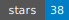
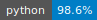
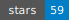
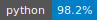
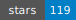
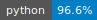
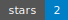
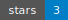
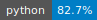
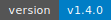

<picture>
  <source media="(prefers-color-scheme: dark)" srcset="https://readme-typing-svg.demolab.com?font=Fira+Code&size=28&duration=3000&pause=1000&color=F7F7F7&background=0D111700&vCenter=true&width=700&lines=Hi%2C+I'm+Ralfo+%F0%9F%91%8B;Moved+to+a+Croatian+island+...;...to+build+data+platforms+in+peace;The+SQL+followed+me+anyway+%F0%9F%98%85;Semantic+Layer+%7C+Knowledge+Graphs+%7C+AI" />
  <source media="(prefers-color-scheme: light)" srcset="https://readme-typing-svg.demolab.com?font=Fira+Code&size=28&duration=3000&pause=1000&color=1A1A1A&background=0D111700&vCenter=true&width=700&lines=Hi%2C+I'm+Ralfo+%F0%9F%91%8B;Moved+to+a+Croatian+island+...;...to+build+data+platforms+in+peace;The+SQL+followed+me+anyway+%F0%9F%98%85;Semantic+Layer+%7C+Knowledge+Graphs+%7C+AI" />
  
</picture>

Founder & Head of R&D at [RALFORION](https://ralforion.com). Building OrionBelt®, an open-source [**Semantic Sidecar**](https://ralforion.com/semantic-sidecar.html) for [Agentic AI](https://ralforion.com/agentic-ai-data-access.html). So AI stops guessing your GROUP BY.

---

> [!TIP]
> **Currently working on:** The [OrionBelt®](https://github.com/ralforion/orionbelt-semantic-layer) ecosystem — a [Semantic Sidecar](https://ralforion.com/semantic-sidecar.html) for Agentic AI with ontology generation, [governed text-to-SQL](https://ralforion.com/text-to-sql.html), MCP server, Apache Arrow Flight, and PostgreSQL Wire Protocol. Because data deserves better than copy-pasted SQL.

---

## 🚀 About Me

- Building [OrionBelt® Semantic Layer](https://github.com/ralforion/orionbelt-semantic-layer), [OrionBelt® Analytics](https://github.com/ralforion/orionbelt-analytics) & [OrionBelt® Ontology Builder](https://github.com/ralforion/orionbelt-ontology-builder) — because data deserves better than copy-pasted SQL
- Semantic data modeling, knowledge graphs, and BI architecture — the stuff that makes dashboards and Agentic AI actually trustworthy
- Longtime Qlik community contributor — extensions, open-source tools, and opinions nobody asked for
- Longtime Gopher 🐹, now addicted to snakes 🐍
- Arctic Code Vault Contributor — my code will survive the apocalypse, no pressure

---

## 🦾 Technologies & Tools

---

## Featured Projects

### [OrionBelt® Analytics](https://github.com/ralforion/orionbelt-analytics)

Ontology-driven analytics platform for AI agents — transforming how data is modeled, explored, and understood through knowledge graphs and semantic reasoning.

    

### [OrionBelt® Semantic Layer](https://github.com/ralforion/orionbelt-semantic-layer)

A universal semantic layer that bridges the gap between raw data and business meaning, enabling consistent metrics and definitions across tools and teams, designed with an API-first approach for agentic AI.

    

### [OrionBelt® Ontology Builder](https://github.com/ralforion/orionbelt-ontology-builder)

A Streamlit-based application for building, editing, and managing OWL ontologies — providing a visual interface to define classes, properties, and relationships for semantic data models.

    

### [OrionBelt® Runner](https://github.com/ralforion/orionbelt-runner)

Run OBML query batches against the OrionBelt® Semantic Layer and emit reports. YAML-defined runs produce self-contained markdown, HTML, or PDF reports with audit-grade YAML run-logs. Built for cron, CI, and scheduled audits.

  

### [OrionBelt® Chat](https://github.com/ralforion/orionbelt-chat)

Conversational AI interface tying the OrionBelt® platform together. 300+ models via OpenRouter, Anthropic & OpenAI direct, local LLMs via MLX or Ollama. Dual MCP server support with sampling, inline Plotly charts, and Mermaid diagrams.

  

### [MCP X-Ray](https://github.com/ralforion/mcp-xray)

X-ray your MCP server — token tax, tool confusion, and surface bloat, distilled into one graded report.

    

---

## Concepts I Write About

- **[What is a Semantic Sidecar?](https://ralforion.com/semantic-sidecar.html)** — the pattern OrionBelt® implements (drop-in governed semantics for AI, analytics, and data systems, no architecture change)
- **[Agentic AI Data Access](https://ralforion.com/agentic-ai-data-access.html)** — governed, consistent, audit-ready access for AI agents via MCP
- **[Governed Text-to-SQL](https://ralforion.com/text-to-sql.html)** — fan-trap prevention via ontology, AST, and MCP
- **[OrionBelt® Platform Overview](https://ralforion.com/orionbelt-one-pager.html)** — the complete stack on one page

---

## GitHub Stats

### Contribution Snake

<picture>
  <source media="(prefers-color-scheme: dark)" srcset="https://raw.githubusercontent.com/ralfbecher/ralfbecher/output/github-snake-dark.svg" />
  <source media="(prefers-color-scheme: light)" srcset="https://raw.githubusercontent.com/ralfbecher/ralfbecher/output/github-snake.svg" />
  
</picture>

---

## Let's Connect

